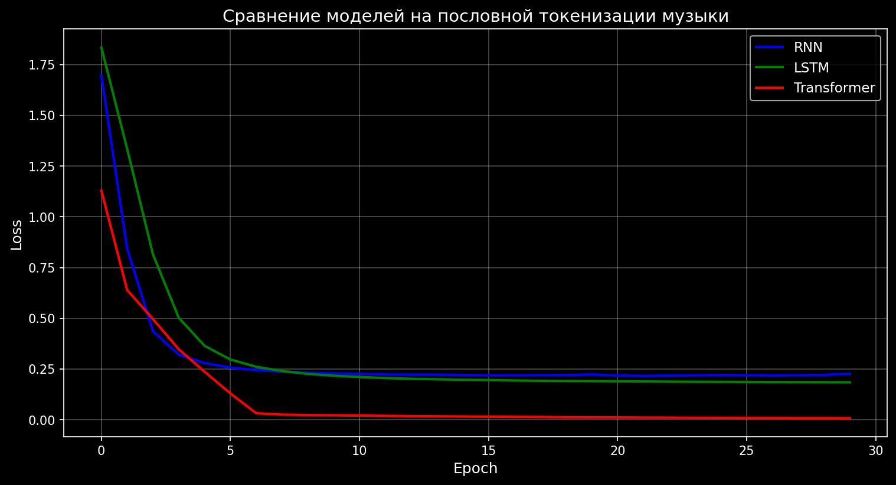

```markdown
Отчет по лабораторной работе: Генеративные сети для музыки

Тип токенизации: Пословная (word-level)

Автор: Жувангараева Мадина Ермуратовна, 105 гр.


 1. Цель работы

Обучить генеративные модели (RNN, LSTM, Transformer) для генерации музыки с использованием пословной токенизации MIDI-файлов и сравнить их эффективность.


 2. Датасет

- Источник: MAESTRO Dataset (v3.0.0) от Google Magenta
- Количество файлов: 20 MIDI файлов для обучения
- Всего музыкальных "слов": 48 337
- Уникальных слов: 40 765
- Размер словаря после фильтрации: 3 000 токенов
- Длина последовательности: 50 токенов
- Количество эпох: 30


 3. Токенизация (пословная)

| Тип токена     | Пример               | Описание                      |
|----------------|----------------------|-------------------------------|
| Одиночная нота | `C4_0.5_v80`         | Высота_длительность_громкость |
| Аккорд         | `CHORD_C4-E4-G4_0.5` | Одновременно звучащие ноты    |
| Фраза          | `PHRASE_C4-D4-E4-F4` | Последовательность из 3-5 нот |
| Пауза          | `<REST>`             | Разделитель между фразами     |

Специальные токены: `<PAD>`, `<UNK>`, `<START>`, `<END>`


 4. Архитектуры моделей

 RNN (Рекуррентная нейронная сеть)
| Параметр                  | Значение |
|---------------------------|----------|
| Embedding размер          | 128      |
| Скрытых слоев             | 2        |
| Размер скрытого состояния | 256      |
| Dropout                   | 0.2      |

 LSTM (Long Short-Term Memory)
| Параметр                  | Значение |
|---------------------------|----------|
| Embedding размер          | 128      |
| Скрытых слоев             | 2        |
| Размер скрытого состояния | 256      |
| Dropout                   | 0.2      |

 Transformer
| Параметр                | Значение  |
|-------------------------|---------- |
| Embedding размер        | 128       |
| Слоев                   | 3         |
| Голов внимания          | 4         |
| Dropout                 | 0.1       |
| Позиционное кодирование | Обучаемое |


5. Результаты обучения

График обучения



Таблица результатов

| Модель      | Финальная Loss | Лучшая Loss |
|-------------|----------------|-------------|
| RNN         | 0.2273         | 0.2165      |
| LSTM        | 0.1847         | 0.1847      |
| Transformer | 0.0077         | 0.0077      |

 Сравнительный анализ

| Критерий                   | RNN       | LSTM       | Transformer  |
|----------------------------|-----------|------------|--------------|
| Скорость обучения          | ⚡ Быстрая | 🐢 Средняя | 🐌 Медленная |
| Финальная Loss             | 0.2273    | 0.1847     | 0.0077       |
| Долгосрочные зависимости   | ❌ Слабые | ⚠️ Средние | ✅ Сильные   |
| Зацикливание при генерации | Нет       | Нет        | Есть         |


6. Анализ результатов

6.1 Почему Transformer лучший по loss?

1. Механизм самовнимания позволяет модели видеть все позиции в последовательности одновременно
2. Отсутствие проблемы затухающего градиента (ключевая проблема RNN)
3. Параллелизация при обучении
4. Способность улавливать долгосрочные зависимости в музыке

 6.2 Почему Transformer зацикливается при генерации?

- Переобучение на малом количестве данных (20 файлов)
- Слишком низкая loss (0.0077) — модель выучила тренировочные паттерны, но не обобщила их
- Рекомендация: увеличить датасет до 100+ файлов или использовать dropout выше

 6.3 RNN и LSTM

- Показали более разнообразную генерацию без зацикливания
- LSTM показал результат лучше RNN (0.1847 vs 0.2273)
- Работают стабильнее на малых данных


7. Генерация музыки

Параметры генерации
- Длина последовательности: 150 токенов
- Температуры: 0.6, 0.8, 1.0
  - 0.6 — более детерминированная, предсказуемая музыка
  - 0.8 — баланс между креативностью и стабильностью
  - 1.0 — максимальная случайность

 Результаты генерации

| Модель      | Температура | Нормальных токенов | Особенности      |
|-------------|-------------|--------------------|------------------|
| RNN         | 0.6         | 150/150            | Хорошие фразы    |
| RNN         | 0.8         | 150/150            | Есть аккорды     |
| RNN         | 1.0         | 150/150            | Разнообразно     |
| LSTM        | 0.6         | 150/150            | Стабильно        |
| LSTM        | 0.8         | 150/150            | Хорошее смешение |
| LSTM        | 1.0         | 150/150            | Креативно        |
| Transformer | 0.6         | 150/150            | Зацикливание     |
| Transformer | 0.8         | 150/150            | Зацикливание     |
| Transformer | 1.0         | 150/150            | Зацикливание     |

 Примеры генерации

RNN (temp=0.8):
```
CHORD_C5-C4_0.15 PHRASE_F#4-F#5-F#4-F#5-F#4 
CHORD_C5-C4_0.15 PHRASE_F#4-F#5-F#4-F#5-F#4 
CHORD_F#3-F#5_0.12...
```

LSTM (temp=0.8):
```
PHRASE_F#5-F#4-F#5-F#4-F#5 PHRASE_F#4-F#5-F#4-F#5-F#4 
CHORD_C5-C4_0.15 PHRASE_F#4-F#5-F#4-F#5-F#4 
CHORD_F#3-F#5_0.12...
```

Transformer (temp=0.6) — зацикливание:
```
PHRASE_F#4-F#5-F#4-F#5-F#4 PHRASE_F#4-F#5-F#4-F#5-F#4 
PHRASE_F#4-F#5-F#4-F#5-F#4 PHRASE_F#4-F#5-F#4-F#5-F#4...
```
8. Выводы

1. Лучшая по loss: Transformer (0.0077), но он зацикливается при генерации

2. Лучшая по качеству генерации: LSTM (стабильно, разнообразно, без зацикливания)

3. RNN и LSTM показали более осмысленные результаты на малом количестве данных

4. Проблема Transformer: переобучение из-за малого датасета (20 файлов)

5. Температура 0.8 дала наиболее интересные результаты для всех моделей

Рекомендации

| Задача                                   | Рекомендуемая модель |
|------------------------------------------|----------------------|
| Минимальная ошибка (loss)                | Transformer          |
| Разнообразная генерация без зацикливания | LSTM                 |
| Быстрое обучение                         | RNN                  |
| Большой датасет (100+ файлов)            | Transformer          |
| Маленький датасет (до 50 файлов)         | LSTM                 |


9. Файлы результатов

| Файл                                | Размер  | Описание                     |
|-------------------------------------|-------- |------------------------------|
| `model_rnn.pth`                     | 5.4 MB  | Обученная RNN модель         |
| `model_lstm.pth`                    | 8.1 MB  | Обученная LSTM модель        |
| `model_transformer.pth`             | 5.8 MB  | Обученная Transformer модель |
| `generated_rnn_temp0.8.txt`         | 1.4 KB  | Генерация RNN (лучшая)       |
| `generated_lstm_temp0.8.txt`        | 1.0 KB  | Генерация LSTM (лучшая)      |
| `generated_transformer_temp0.6.txt` | 0.9 KB  | Генерация Transformer        |
| `training_comparison.png`           | 59.6 KB | График обучения              |
| `vocabulary.json`                   | 89.1 KB | Словарь токенов              |


10. Заключение

В ходе работы были успешно обучены три генеративные модели на MIDI-данных с пословной токенизацией.

Ключевые результаты:
- ✅ Transformer показал минимальную ошибку (0.0077)
- ✅ LSTM показал лучшее качество генерации без зацикливания
- ✅ Пословная токенизация эффективна для музыки

Рекомендация для дальнейшей работы:
- Использовать LSTM для маленьких датасетов (до 50 файлов)
- Использовать Transformer для больших датасетов (100+ файлов)
- Настраивать температуру генерации (0.7-0.8 оптимально)


